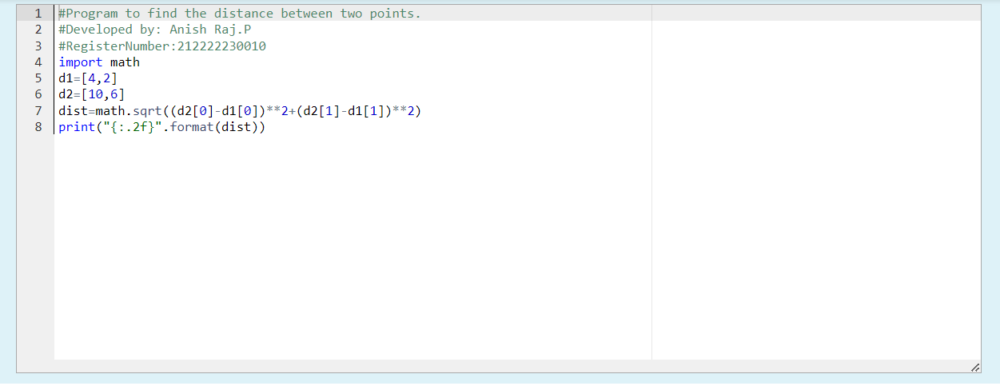
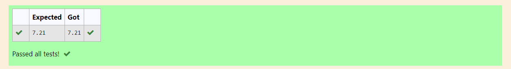

# DISTANCE-BETWEEN-TWO-POINTS

## AIM:
To write a python program to find the distance two 2 points
## ALGORITHM:
### Step 1: 
Get the two list from the user
### Step 2: 
Import the math module
### Step 3: 
Substitute the values in the distance formula  
### Step 4: 
Print the value using the format function
### Step 5: 
End the program
### PROGRAM:
```
#Program to find the distance between two points.
#Developed by: Anish Raj.P
#RegisterNumber:212222230010
import math
d1=[4,2]
d2=[10,6]
dist=math.sqrt((d2[0]-d1[0])**2+(d2[1]-d1[1])**2)
print("{:.2f}".format(dist))
```
  
### OUTPUT:





### RESULT:
Thus the difference between two points is found.
